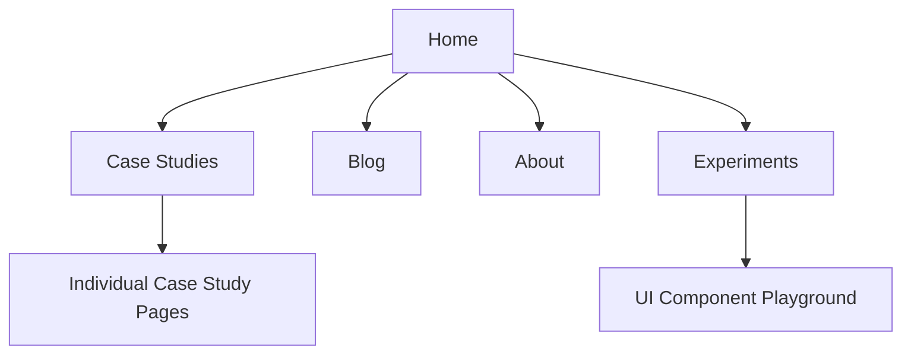

# Portfolio Platform Overview

### Core Purpose
Interactive showcase portfolio emphasizing:
- Case study presentations
- Technical experimentation
- Visual storytelling
- Mobile-first design

### Key User-Facing Features
**Content Showcases**
- Case study deep dives with dynamic routing
- Skills matrix with animated visualizations
- Project galleries with card-based navigation
- Interactive blog section

**Technical Highlights**
- iOS-style UI components (Dynamic Island, Chat interface)
- Animated transitions between sections
- Experimental playground area
- Custom font integrations
- Responsive image handling

**Content Structure**

### Unique Differentiators
1. Built-in experimental UI concepts
2. Hybrid portfolio/playground format
3. Strong mobile interaction patterns
4. Rich animation library integration